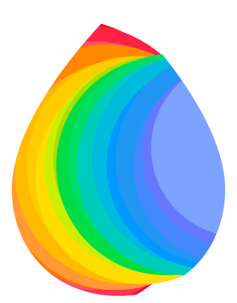

# Minerva


## Description of the project

**Minerva** is an **AI-powered Chrome extension** and **open-source project** designed to help users to **summarize, translate, chat, generate, and listen to written content directly in their browser.**

It combines Google **GenAI APIs** with **Chrome’s built-in experimental AI APIs** to make online browsing and content creation faster and more accessible.

## Core Features

-  Summarize (TL;DR)
    - Text (Summarizer API)
    - PDFs or Images _(Gemini 2.5 Flash)_
    - YouTube _videos (Gemini 2.5 Flash)_
    - Selected webpages or webpages areas _(Chrome’s Summarizer API)_
        -  Listen — Text-to-speech with 30 voice options
        - “Explain for kids” simplification (Rewriter API)

-  Chat & Q&A
    - Ask follow-up questions about any text or webpage (Prompt API)

-  Create
    - Write text, giving tone and context (via Writer API)
    - Images _(Imagen 4.0 Fast)_
    - Translations (Translator API)
    - Speech _(Gemini 2.5 Flash TTS)_

## What inspired us

> As an avid reader of research papers on large language models (LLMs), I often found it challenging to extract the key insights from lengthy and complex papers. To make this process faster and more convenient, I initially built the Chrome extension around a simple “TL;DR” feature — designed to summarize massive papers into clear, digestible overviews. — *agavrel*

> What started as a small idea soon snowballed into an all-in-one extension, expanding beyond summaries to offer a richer, more interactive browsing experience. — *pgiammel*

## How we built the project

* Stack: React + Chrome Built-in AI APIs + Google GenAI Cloud APIs *(optional, requires API Key)*
* Architecture: atomic-design
* Process: fast iteration between features design and coding
* Challenges: The production of the demo video


## APIs Used

- Chrome Built-in AI APIs: Summarizer, Language Model, Writer, Rewriter, Translator

- Google GenAI Cloud APIs: Gemini 2.5 Flash (summarization, TTS), Imagen 4.0 Fast (image generation) which requires Google API key (optional)

**We are not responsible for any billing charges resulting from its usage, nor do we derive any financial benefit from it. Please review the applicable pricing details before proceeding.**

## Requirements

To access all the features of the extension, you will need an up-to-date version
of Chrome and the following flags enabled:

- [Prompt API for Gemini Nano](chrome://flags/#prompt-api-for-gemini-nano)
- [Summarization API for Gemini Nano](chrome://flags/#summarization-api-for-gemini-nano)
- [Writer API for Gemini Nano](chrome://flags/#writer-api-for-gemini-nano)
- [Rewriter API for Gemini Nano](chrome://flags/#rewriter-api-for-gemini-nano)
- [Experimental translation API](chrome://flags/#translation-api)

You will need to enable at least `Summarization API for Gemini Nano` for the extension to work.

If compiling the extension from this project with `npm run build` you need to add the different trial tokens (for Prompt, Writer, Rewriter API etc) in manifest.json: 

```
 "trial_tokens": ["....AAAA="]
```

## Onboarding

When no model is downloaded on your Chrome yet, the extension will first have
to download it. You will be presented with a progress bar. It seems to gets a
bit stuck around the end, but please be patient, it'll take just a few more
minutes.